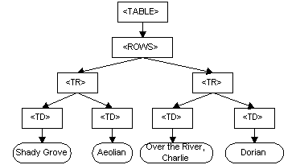

# Homework FE

## About source code

Next.js App Router Course - Starter

This is the starter template for the Next.js App Router Course. It contains the starting code for the dashboard application.

For more information, see the [course curriculum](https://nextjs.org/learn) on the Next.js Website.

## Questions

Q1: What is Document Object Model (DOM)?

The Document Object Model (DOM) is a programming interface for web documents. It represents the struct of a document as a tree of object, making it possible for programming languages such as JavaScript to interact with, manipulate, and update the content, structure, and style of a document dynamically.

For instance, consider the table, taken from an HTML document:

```html
<table>
  <ROWS>
    <tr>
      <td>Shady Grove</td>
      <td>Aeolian</td>
    </tr>
    <tr>
      <td>Over the River, Charlie</td>
      <td>Dorian</td>
    </tr>
  </ROWS>
</table>
```

The Document Object Model represents this table like this:



Why DOM is important?

- DOM allow web pages to be interactive. By manipulating the DOM, developer can create dynamic web application that response to user input.
- With DOM, developer can use familiar programming languages like JavaScript to access and modify web pages.
- DOM is standardized by the World Wide Web Consortium (W3C), ensuring a consistent approach across different browsers and platforms.

Q2: How React or Vue can manipulate DOM?

ReactJS manipulates the DOM using **virtual DOM**, which is a lightweight representation of the actual DOM. Like ReactJS, Vue.js also uses a virtual DOM to efficiently manipulate the actual DOM.

Both ReactJS and Vue.js use a virtual DOM, but they do it in slightly different ways.

**ReactJS**

React uses a component-based architecture where each component manages its own state and renders a part of the UI.
Components are written using JSX, a syntax that lets you write HTML-like code within JavaScript.
When the state of a component changes, React re-renders the virtual DOM for that component.

React's reconciliation algorithm then compares the new virtual DOM with the previous one to identify differences.
It figures out the most efficient way to update the actual DOM based on these differences, which minimizes direct DOM manipulations and boosts performance. React also batches multiple state updates to further optimize rendering.

**VueJS**

Vue, on the other hand, uses an HTML-based template syntax. These templates are compiled into render functions that generate the virtual DOM.
Vue has reactive data binding system that automatically updates the virtual DOM when the underlying data changes.

VUe's reactivity system uses observers and watchers to track data changes. When data changes, Vue update the virtual DOM and then uses a diffing algorithm to compare it with the old virtual DOM.
This process helps Vue determine the most efficient way to update the actual DOM. Vue also batches updates to optimize performance.
